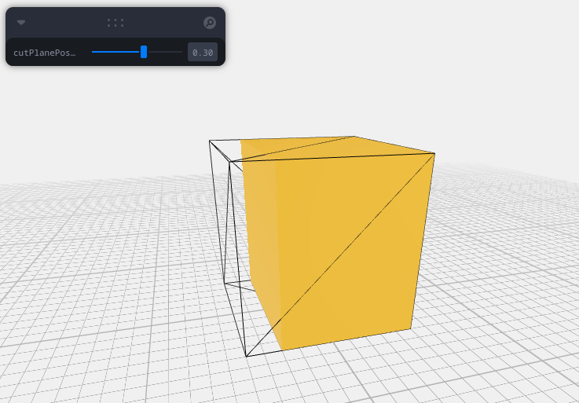

# Overview
This package provides a `<Cutter>` component based on [react-three-fiber](https://github.com/pmndrs/react-three-fiber) that can clip and cap [Mesh](https://threejs.org/docs/index.html?q=Mesh#api/en/objects/Mesh)es in an arbitrary scene in a manner similar to [this](https://codesandbox.io/s/r3f-torus-capped-9f5kyb) example. A `<Cutter>` will clip and cap all descendant meshes using a [Plane](https://threejs.org/docs/index.html?q=Plane#api/en/math/Plane) specified via its `plane` prop. This gives the meshes the appearance of filled solids instead of hollow objects with just surfaces. The caps at the clipping plane position use the same material as the original meshes. This means that each mesh will get a cap that looks like its own material. See [Limitations/Bugs](#limitationbugs) section below for some issues with the current implementation that are expected to be fixed in the future. 

A simple example of usage is something like:

```jsx
import Cutter from '@r3f-cutter/r3f-cutter';

// ...later...
<Cutter plane={xPlane}>
  <mesh position={[0, 0.5, 0]}>
    <boxGeometry />
    <meshStandardMaterial color="orange" />
  </mesh>
</Cutter>
```



# Installation

```sh
npm i @r3f-cutter/r3f-cutter
```

# Live Examples
- https://codesandbox.io/s/gifted-sound-q3uip1

# Limitation/Bugs
- Only one plane supported at present. Support for multiple planes will be added. 
- Caps use the same material as the original [Mesh](https://threejs.org/docs/index.html?q=Mesh#api/en/objects/Mesh). If the [Mesh](https://threejs.org/docs/index.html?q=Mesh#api/en/objects/Mesh) uses [an array of materials](https://threejs.org/docs/index.html?q=Mesh#api/en/objects/Mesh.material) then it is capped using the first material from the list. 
- If the [Mesh](https://threejs.org/docs/index.html?q=Mesh#api/en/objects/Mesh) is modified after it is initially clipped (for example, via [useFrame()](https://docs.pmnd.rs/react-three-fiber/api/hooks#useframe)) then the caps are not correctly recomputed. This needs to be fixed.
- It might be useful to have an option to disable capping entirely and just use clipping.
